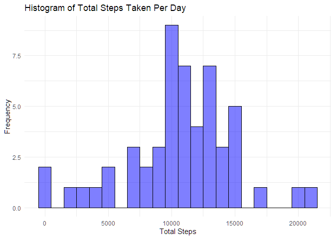
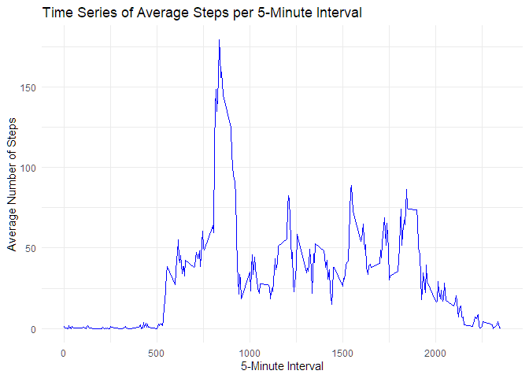
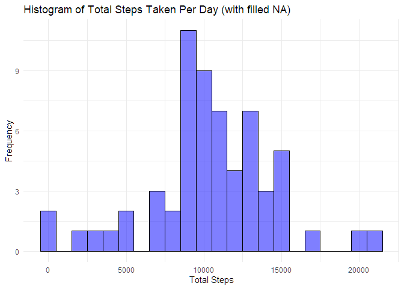
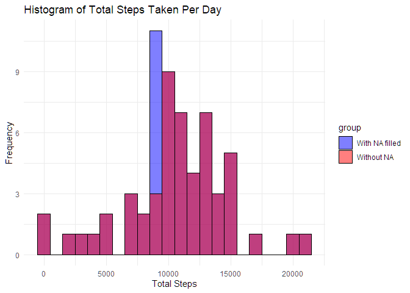
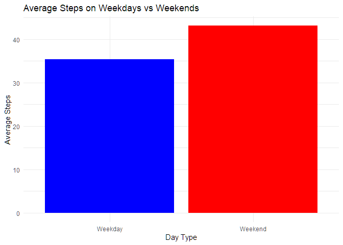

## Loading and preprocessing the data
Load necessary libraries

``` r
library(dplyr)
library(tidyr)
library(ggplot2)
rm(list = ls())
```
Define a function to read CSV from a ZIP file

``` r
read_csv_from_zip <- function() {
  # Specify the path to the ZIP file and the name of the CSV file inside it
  zip_file <- "activity.zip"
  csv_file <- "activity.csv" 
  # Read the CSV file directly from the ZIP archive
  data <- read.csv(unz(zip_file, csv_file))
  
  # Return the data frame containing the CSV data
  return(data)
}
```

Read the CSV file directly from the ZIP archive

``` r
data <- read_csv_from_zip()
```

View the first few rows of the data

``` r
head(data)
```

```
##   steps       date interval
## 1    NA 2012-10-01        0
## 2    NA 2012-10-01        5
## 3    NA 2012-10-01       10
## 4    NA 2012-10-01       15
## 5    NA 2012-10-01       20
## 6    NA 2012-10-01       25
```


## What is mean total number of steps taken per day?

Filter rows where 'steps' is not NA and not zero, and convert 'steps' to numeric

``` r
data_filtered <- data %>%
  dplyr::filter(!is.na(steps) ) %>%  # Filter out NA and 0 values in 'steps'
  dplyr::mutate(steps = as.numeric(steps))       # Convert 'steps' column to numeric

# Display the filtered data
head(data_filtered)
```

```
##   steps       date interval
## 1     0 2012-10-02        0
## 2     0 2012-10-02        5
## 3     0 2012-10-02       10
## 4     0 2012-10-02       15
## 5     0 2012-10-02       20
## 6     0 2012-10-02       25
```
##### 1. Calculate the total number of steps taken per day
Group by 'date' and calculate the total number of steps per day

``` r
total_steps_per_day <- data_filtered %>%
  group_by(date) %>%
  summarise(
    total_steps = sum(steps, na.rm = TRUE)
  )

head(total_steps_per_day)
```

```
## # A tibble: 6 x 2
##   date       total_steps
##   <chr>            <dbl>
## 1 2012-10-02         126
## 2 2012-10-03       11352
## 3 2012-10-04       12116
## 4 2012-10-05       13294
## 5 2012-10-06       15420
## 6 2012-10-07       11015
```

##### 2. Create a histogram of the total steps per day

``` r
ggplot(total_steps_per_day, aes(x = total_steps)) +  # Initialize ggplot with 'total_steps' on the x-axis
  geom_histogram(  # Plot the histogram
    binwidth = 1000,  # Set the width of each bin (interval size)
    color = "black",  # Outline color of the bars
    fill = "blue",  # Fill color of the bars
    alpha = 0.5  # Transparency level of the bars (0 is fully transparent, 1 is fully opaque)
  ) +
  labs(  # Add labels to the plot
    title = "Histogram of Total Steps Taken Per Day",  # Title of the plot
    x = "Total Steps",  # Label for the x-axis
    y = "Frequency"  # Label for the y-axis
  ) +
  theme_minimal()  # Use a minimal theme for a clean and simple appearance
```

<!-- -->
  
##### 3. Calculate and report the mean and median of the total number of steps taken per day

``` r
mean_steps <- mean(total_steps_per_day$total_steps)
mean_steps<-format(mean_steps, scientific = FALSE, digits = 6, big.mark = ",")
median_steps <- median(total_steps_per_day$total_steps)
median_steps<-format(median_steps, scientific = FALSE, digits = 6, big.mark = ",")
```

The __mean__ of the total number of steps taken per day   __10,766.2__.  
The __median__ of the total number of steps taken per day __10,765__.


 


## What is the average daily activity pattern?
##### 1. Make a time series plot (i.e. type = "l") of the 5-minute interval (x-axis) and the average number of steps taken, averaged across all days (y-axis)
Replace NA values with 0 in the steps column

``` r
data_clean <- data %>%
  mutate(steps = ifelse(is.na(steps), 0, steps))  # Replace NA with 0
  
average_steps_per_interval <- data_clean %>%
  group_by(interval) %>%
  summarise(average_steps = mean(steps, na.rm = TRUE))
```
Create the time series plot (line plot)

``` r
ggplot(average_steps_per_interval, aes(x = interval, y = average_steps)) +
  geom_line(color = "blue") +  # Line plot with blue color
  labs(title = "Time Series of Average Steps per 5-Minute Interval",
       x = "5-Minute Interval",
       y = "Average Number of Steps") +
  theme_minimal()  # Minimal theme for clean presentation
```

<!-- -->
  
##### 2. Which 5-minute interval, on average across all the days in the dataset, contains the maximum number of steps?

``` r
max_interval <- average_steps_per_interval %>%
  filter(average_steps == max(average_steps)) %>%
  select(interval, average_steps)
interval<-max_interval$interval
```
Convert interval to time

``` r
hours <- interval %/% 60  # Integer division to get hours
minutes <- interval %% 60  # Modulo to get minutes

# Format the time in HH:MM format
time_of_day <- sprintf("%02d:%02d", hours, minutes)
```
  
The 5-minute interval with maximum of steps is: __835__.   
This corresponds to time of day: __13:55__. 


## Imputing missing values
Note that there are a number of days/intervals where there are missing values. 
The presence of missing days may introduce bias into some calculations or summaries of the data.

#### 1. Calculate and report the total number of missing values in the dataset 
(i.e. the total number of rows with NAs)

``` r
total_missing_values <- sum(is.na(data))
```
The total number of missing values __2304__  

#### 2. Devise a strategy for filling in all of the missing values in the dataset. 
The strategy does not need to be sophisticated. 
For example, you could use the mean/median for that day, or the mean for that 5-minute interval, etc.

We already head an average steps per interval dataframe calculated.
We will do LEFT JOIN to the original **data** and assign values where they are missing.

#### 3. Create a new dataset that is equal to the original dataset but with the missing data filled in.

``` r
# Join the dataset with the median values for each 5-minute interval
data_filled <- data %>%
  
  # Perform a left join to combine the original data with the median steps for each interval
  left_join(average_steps_per_interval, by = "interval") %>%
  
  # Use 'mutate' to replace NA values in the 'steps' column with the corresponding median steps from 'median_per_interval'
  mutate(steps = ifelse(is.na(steps), average_steps, steps)) %>%
  
  # Remove the temporary 'average_steps' column, which was used for filling the missing values
  select(-average_steps)  # Removes 'average_steps' after it's no longer needed
```
#### 4. Make a histogram of the total number of steps taken each day and calculate and report the mean and median total number of steps taken per day. 
Calculate the total number of steps taken per day
Group by 'date' and calculate the total number of steps per day

``` r
total_steps_per_day_filled <- data_filled %>%
  group_by(date) %>%
  summarise(
    total_steps = sum(steps, na.rm = TRUE)
  )
```


``` r
ggplot(total_steps_per_day_filled, aes(x = total_steps)) +  # Initialize ggplot with 'total_steps' on the x-axis
  geom_histogram(  # Plot the histogram
    binwidth = 1000,  # Set the width of each bin (interval size)
    color = "black",  # Outline color of the bars
    fill = "blue",  # Fill color of the bars
    alpha = 0.5  # Transparency level of the bars (0 is fully transparent, 1 is fully opaque)
  ) +
  labs(  # Add labels to the plot
    title = "Histogram of Total Steps Taken Per Day (with filled NA)",  # Title of the plot
    x = "Total Steps",  # Label for the x-axis
    y = "Frequency"  # Label for the y-axis
  ) +
  theme_minimal()  # Use a minimal theme for a clean and simple appearance
```

<!-- -->

##### A) Do these values differ from the estimates from the first part of the assignment? 


``` r
# Combine both datasets into one, adding a 'group' column to distinguish them
combined_data <- rbind(
  data.frame(total_steps = total_steps_per_day_filled$total_steps, group = "With NA filled"),
  data.frame(total_steps = total_steps_per_day$total_steps, group = "Without NA")
)

# Plot the histogram for both series on the same plot
ggplot(combined_data, aes(x = total_steps, fill = group, color = group)) + 
  geom_histogram(
    binwidth = 1000,  # Set the width of each bin
    position = "identity",  # Keep the bars on top of each other (overlay)
    alpha = 0.5,  # Transparency level for bars
    show.legend = TRUE  # Show the legend to distinguish the series
  ) +
  labs(
    title = "Histogram of Total Steps Taken Per Day",
    x = "Total Steps",
    y = "Frequency"
  ) +
  theme_minimal() +  # Clean theme
  scale_fill_manual(values = c("blue", "red")) +  # Custom fill colors
  scale_color_manual(values = c("black", "black"))  # Custom outline color
```

<!-- -->

##### B) What is the impact of imputing missing data on the estimates of the total daily number of steps?
The blue bars (With NA Filled) show a much higher frequency of total steps, particularly around the 10,000 mark. This suggests that imputing missing values has added a large number of steps to certain days.
The blue bars appear to skew the distribution by artificially inflating the number of steps taken per day for the missing entries. This is because the missing values were filled with the average steps for that 5-minute interval, which likely falls within a certain range, contributing to the high frequency around 10,000 steps.

## Are there differences in activity patterns between weekdays and weekends?

``` r
# Convert 'date' column to Date format if it is not already in Date format
data$date <- as.Date(data$date)
Sys.setlocale("LC_TIME", "English")
```

```
## [1] "English_United States.1252"
```

``` r
# Create a new column to classify days as Weekday or Weekend
data <- data %>%
  mutate(day_of_week = weekdays(date),  # Extract the weekday
         weekend = ifelse(day_of_week %in% c("Saturday", "Sunday"), "Weekend", "Weekday"))
```

``` r
# Calculate the average number of steps per day for Weekdays and Weekends
average_steps_by_day <- data %>%
  group_by(weekend) %>%
  summarise(average_steps = mean(steps, na.rm = TRUE))

# Print the average steps for weekdays and weekends
head(average_steps_by_day)
```

```
## # A tibble: 2 x 2
##   weekend average_steps
##   <chr>           <dbl>
## 1 Weekday          35.3
## 2 Weekend          43.1
```

``` r
# Create the bar plot
ggplot(average_steps_by_day, aes(x = weekend, y = average_steps, fill = weekend)) + 
  geom_bar(stat = "identity", show.legend = FALSE) +  # Create bars (identity means use 'average_steps' as height)
  labs(
    title = "Average Steps on Weekdays vs Weekends",
    x = "Day Type",
    y = "Average Steps"
  ) +
  scale_fill_manual(values = c("blue", "red")) +  # Customize bar colors (blue for Weekday, red for Weekend)
  theme_minimal()  # Clean minimal theme
```

<!-- -->
  
The plot clearly shows that people tend to take more steps on weekends than on weekdays, as indicated by the taller red bar.
